# 🗂️ Employee Project Management System — Feature Flowchart

> **Stack:** Next.js 14 (App Router) · Node.js/Express · PostgreSQL · Prisma ORM  
> **Last Updated:** February 2026

---

## 🔁 System Entry Flow

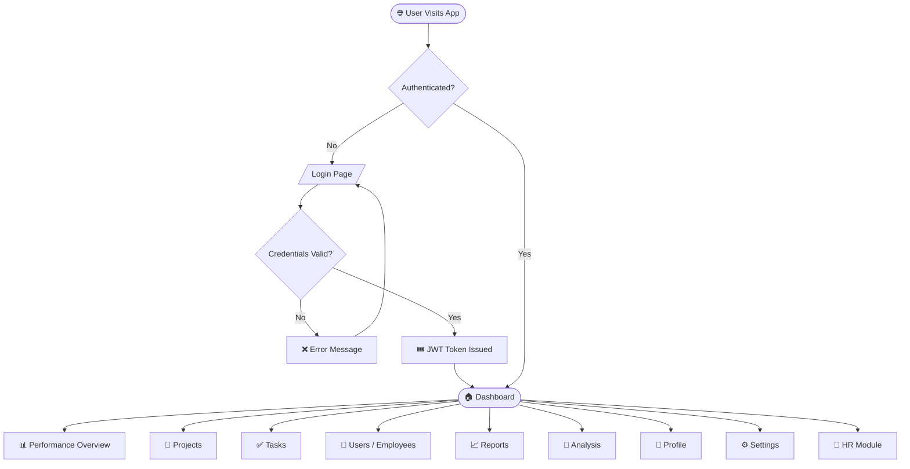

---

## 🔐 1. Authentication & User Management

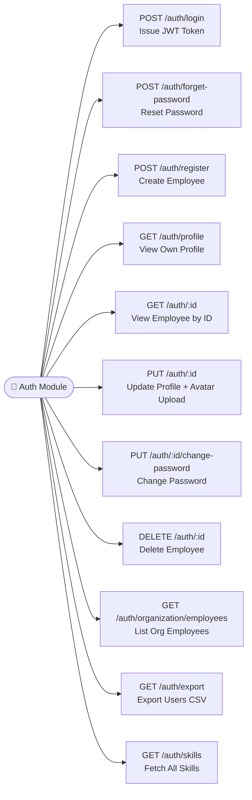

**Key Employee Fields:** `firstName`, `lastName`, `email`, `position`, `role (ADMIN|USER)`, `skills[]`, `responsibilities[]`, `dob`, `bloodGroup`, `image`, `phoneNumber`, `emergencyContact`, `address`, `joiningDate`, `isHR`

---

## 📁 2. Project Management

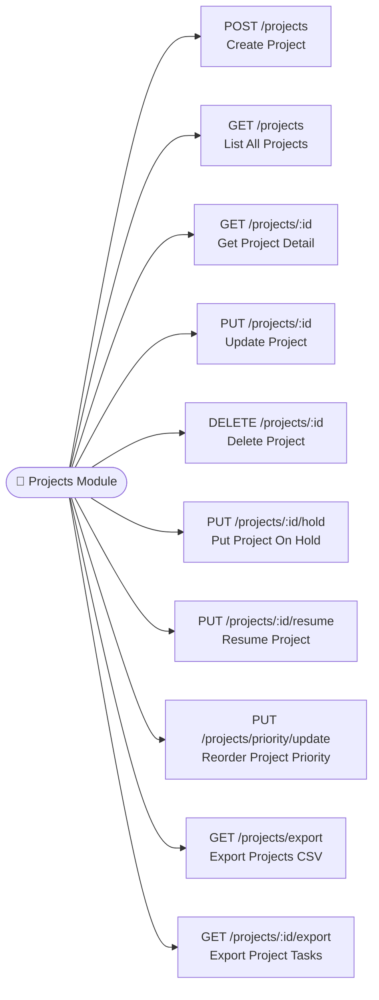

**Project Lifecycle:**

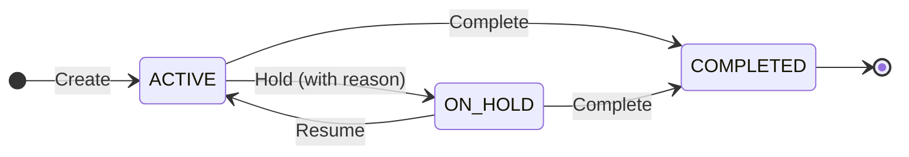

**Project Fields:** `name`, `description`, `startDate`, `endDate`, `priority_order`, `status`, `head (Employee)`, `holdHistory[]`

---

## ✅ 3. Task Management

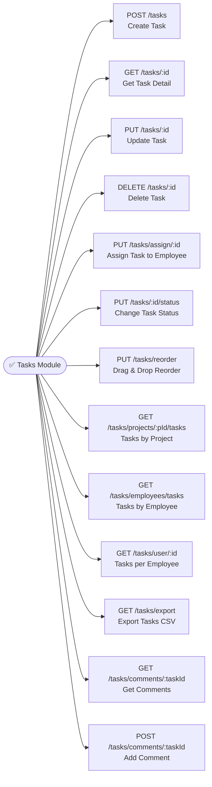

### Task Types

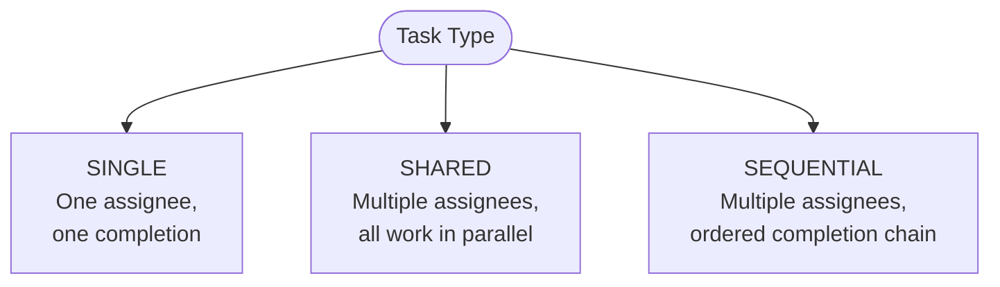

### Task Status Flow

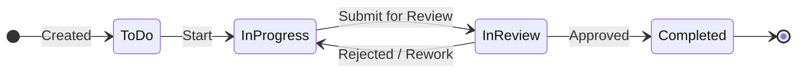

**Task Fields:** `description`, `status`, `priority (LOW|MEDIUM|HIGH)`, `points`, `dueDate`, `order`, `type`, `parentId (SubTask)`, `assignees[]`, `comments[]`

---

## 💬 4. Comments System

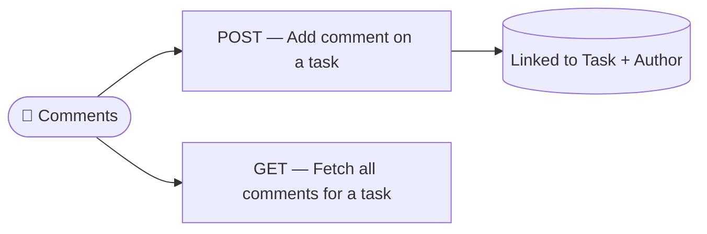

---

## 📊 5. Performance & Dashboard

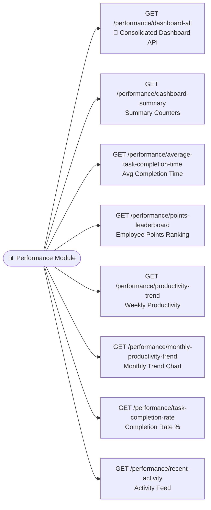

---

## 📈 6. Reports Module

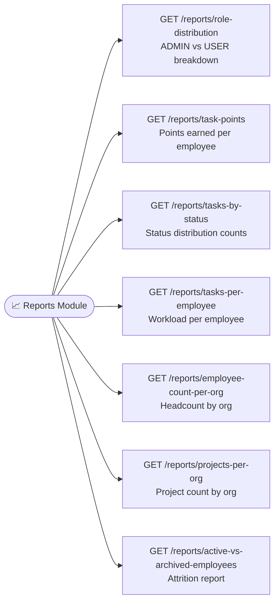

---

## 🔬 7. Analysis Module (AI-style Insights)

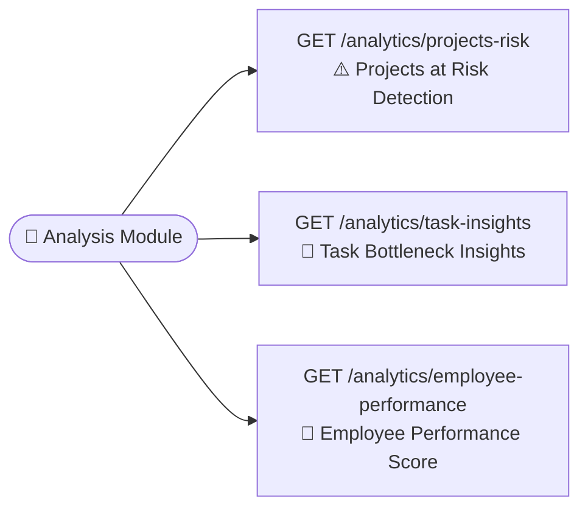

---

## 🏢 8. HR Module

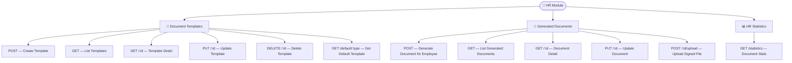

**Document Types:** `OFFER_LETTER` · `JOINING_LETTER` · `PROMOTION_LETTER` · `TERMINATION_LETTER` · `APPRECIATION_LETTER` · `WARNING_LETTER` · `OTHER`

**Document Status Flow:**

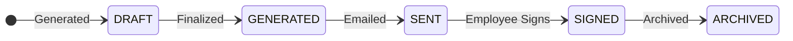

---

## 🏗️ 9. Organization Management

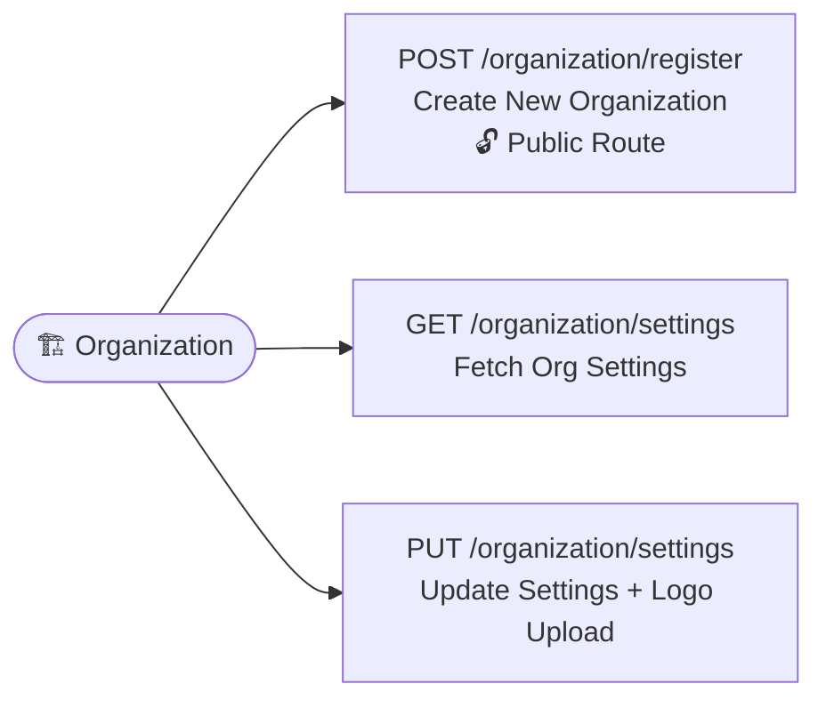

---

## ⏱️ 10. Time Tracking (TimeLogs)

> Managed in the data layer — logged automatically via device check-in/check-out.

| Field | Details |
|---|---|
| `checkIn` | Timestamp of clock-in |
| `checkOut` | Timestamp of clock-out |
| `type` | `WORK`, `LUNCH`, `BREAK`, `WASHROOM`, `PERSONAL_EMERGENCY`, `HOME`, `OTHER` |
| `latitude / longitude` | Geolocation of the log |
| `deviceId / deviceType` | Device fingerprint |
| `reason` | Optional reason for log type |

---

## 🧩 11. Frontend Pages (Next.js App Router)

```mermaid
flowchart TD
    PAGES([📱 Frontend Pages])

    PAGES --> FP1[🏠 /dashboard\nMain Dashboard — KPIs + Activity]
    PAGES --> FP2[📁 /dashboard/projects\nProject List + Create + Status Management]
    PAGES --> FP3[✅ /dashboard/tasks\nAll Tasks View — Kanban / Table]
    PAGES --> FP4[✅ /dashboard/tasks/:taskId\nTask Detail — Subtasks, Comments, Assignees]
    PAGES --> FP5[👥 /dashboard/users\nEmployee Directory]
    PAGES --> FP6[👤 /dashboard/profile\nMy Profile + Edit]
    PAGES --> FP7[📈 /dashboard/reports\nReports & Charts]
    PAGES --> FP8[📊 /dashboard/performance\nPerformance Dashboard]
    PAGES --> FP9[🔬 /dashboard/analysis\nAI-style Insights]
    PAGES --> FP10[🏢 /dashboard/hr\nHR Document Center]
    PAGES --> FP11[⚙️ /dashboard/settings\nOrg & App Settings]
```

---

## 🛡️ 12. Middleware Stack

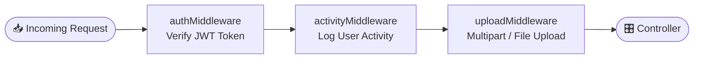

---

## 🗄️ 13. Data Model Overview (Entity Relationships)

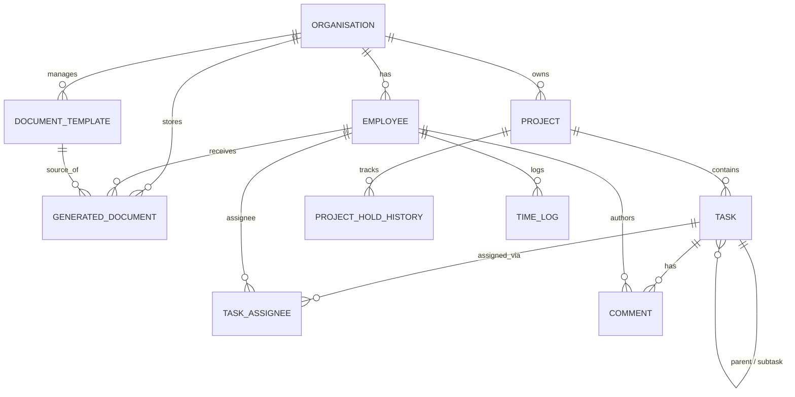

---

## 🚦 Role-Based Access Summary

| Feature | ADMIN | USER (Employee) |
|---|:---:|:---:|
| Register Employees | ✅ | ❌ |
| Delete Employees | ✅ | ❌ |
| Create / Edit Projects | ✅ | ❌ |
| Hold / Resume Projects | ✅ | ❌ |
| Create Tasks | ✅ | ✅ |
| Assign Tasks | ✅ | ✅ |
| Update Task Status | ✅ | ✅ |
| View All Reports | ✅ | ❌ |
| HR Document Generation | ✅ (isHR) | ❌ |
| View Own Tasks | ✅ | ✅ |
| Edit Own Profile | ✅ | ✅ |
| Organization Settings | ✅ | ❌ |

---

> 💡 **Tip:** All protected routes require a valid `Authorization: Bearer <token>` header. Organization context is derived from the JWT payload — no tenant ID required in the URL.
